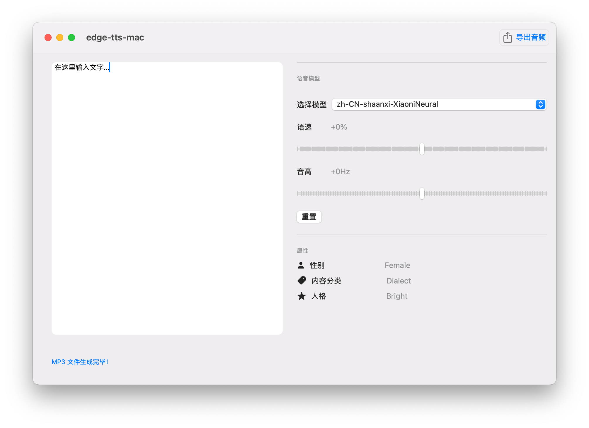

# edge-tts-mac
edge-tts的macOS GUI
没有开发者账号无法打包发布，有需要可以自行clone编译。
## 预览图

### 使用的第三方组件

本项目使用了 [edge-tts](https://github.com/rany2/edge-tts)，该组件基于 **LGPL-3.0** 授权。  
如果您需要更多信息，请查看 edge-tts 的源代码与许可证文件。

### 许可证
本项目代码基于 [MIT License](LICENSE) 许可发布。  
